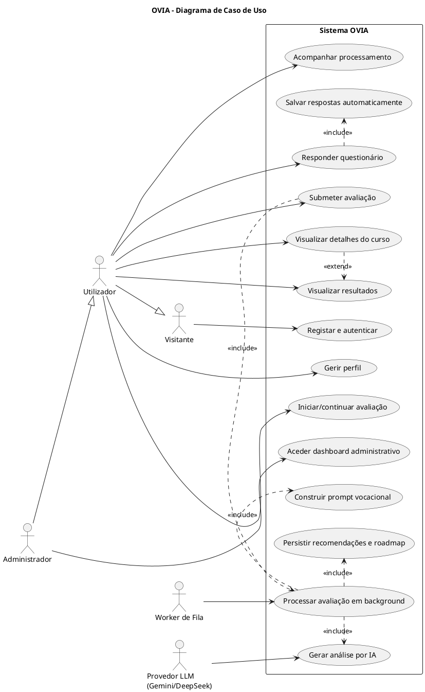
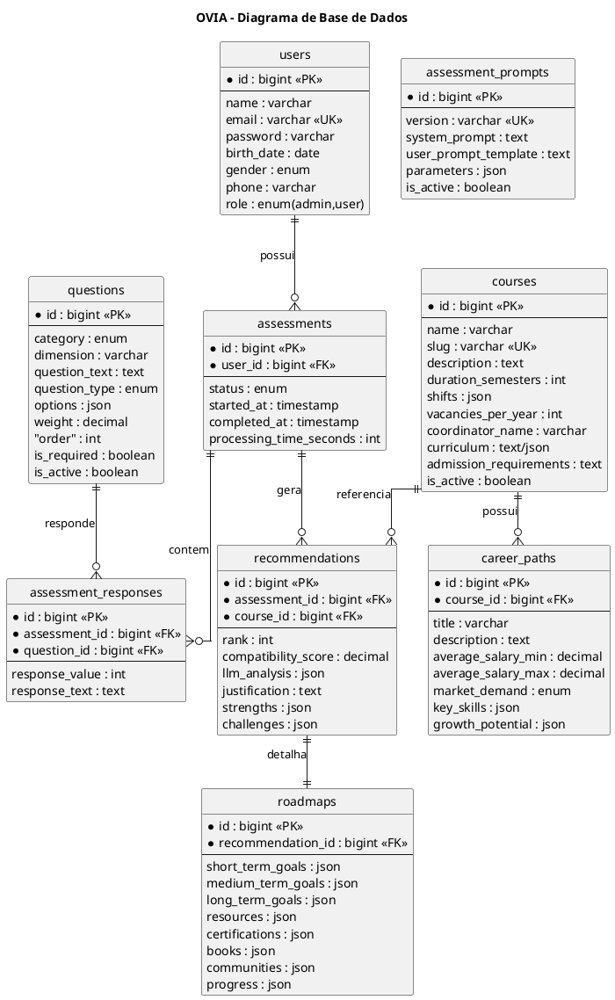
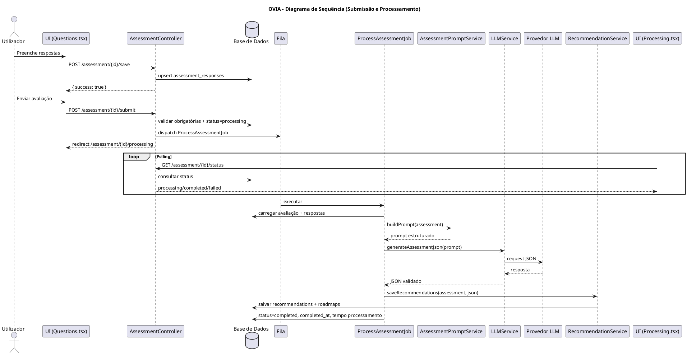
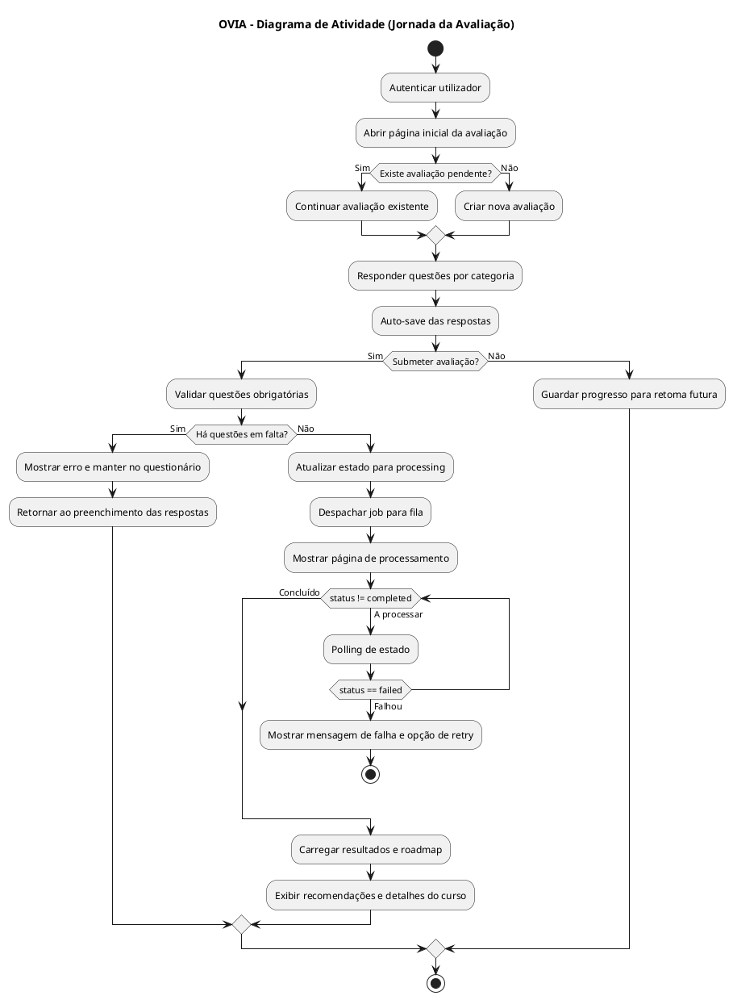

# 3 DESENVOLVIMENTO DO SISTEMA

Este capítulo descreve a construção do OVIA com base na implementação existente no projeto. O sistema foi desenvolvido para apoiar a orientação vocacional de estudantes, integrando questionário estruturado, processamento assíncrono e recomendação de cursos com Inteligência Artificial.

## 3.1 ARQUITECTURA DO SISTEMA OVIA

A arquitectura do OVIA segue uma abordagem em camadas:

- Camada de apresentação: páginas React/TypeScript renderizadas por Inertia.js.
- Camada de aplicação: controladores Laravel responsáveis por validação, orquestração de fluxo e regras de navegação.
- Camada de domínio/serviços: geração de prompt (`AssessmentPromptService`), integração LLM (`LLMService`) e persistência das recomendações (`RecommendationService`).
- Camada de dados: modelos Eloquent e base de dados relacional com entidades de avaliação, respostas, cursos, recomendações e roadmap.
- Camada assíncrona: fila de jobs (`ProcessAssessmentJob`) para processar a análise por IA sem bloquear a experiência do utilizador.

O fluxo principal inicia no módulo de avaliação, passa pela submissão das respostas, aciona processamento em background e termina com a disponibilização de resultados e plano de evolução profissional.

### Diagrama de Caso de Uso

### Diagrama de Base de Dados

## 3.2 TECNOLOGIAS UTILIZADAS

As tecnologias identificadas no projeto e sua função no sistema são:

- Laravel 12.21.0: núcleo backend, roteamento, autenticação, ORM Eloquent, filas e validação.
- PHP: implementação dos controladores, serviços de negócio e job assíncrono.
- SQLite (ambiente local): persistência principal de dados.
- Inertia.js 2 + React 19 + TypeScript: interface dinâmica e integração SPA sem abandonar o backend Laravel.
- Tailwind CSS 3 + Radix UI + componentes utilitários: construção da interface com foco em produtividade.
- Vite 7: build e hot reload do frontend.
- HTTP Client do Laravel: comunicação com provedores LLM.
- Provedores LLM (Gemini e DeepSeek): geração da análise vocacional e recomendações.
- Queue (driver `database`): execução assíncrona do `ProcessAssessmentJob`.
- Pest/PHPUnit: cobertura de testes para fluxo de avaliação, processamento e robustez do motor de IA.

## 3.3 IMPLEMENTAÇÃO DAS FUNCIONALIDADES

As funcionalidades foram implementadas em fluxo contínuo:

1. O utilizador inicia ou retoma uma avaliação (`/assessment/start` e `/assessment/create`).
2. O questionário é carregado por categoria e as respostas são salvas automaticamente (`/assessment/{id}/save`).
3. Na submissão (`/assessment/{id}/submit`), o sistema valida respostas obrigatórias e muda o estado para `processing`.
4. O job de processamento é enviado para fila e executa o pipeline de IA.
5. A página de processamento consulta periodicamente o estado (`/assessment/{id}/status`).
6. Ao concluir, os resultados e detalhes de curso são exibidos ao utilizador.

O sistema também trata cenários de conflito e recuperação, como avaliações já concluídas, em processamento ou com falha, encaminhando o utilizador para a rota correta.

### Diagrama de Sequência

### Diagrama de Atividade

## 3.4 MÓDULO DE AVALIAÇÃO VOCACIONAL

O módulo de avaliação vocacional foi estruturado em quatro categorias centrais: interesses, habilidades, valores e personalidade. As questões suportam três tipos de resposta:

- Likert (escala numérica de 1 a 5).
- Múltipla escolha.
- Resposta aberta.

Do ponto de vista funcional, o módulo apresenta:

- Cálculo de progresso em tempo real.
- Navegação por secções/categorias.
- Persistência automática (auto-save) para reduzir perda de dados.
- Validação de questões obrigatórias antes da submissão.
- Retoma de avaliação pendente para continuidade da experiência.

Essa implementação aumenta a confiabilidade do processo e melhora a qualidade dos dados enviados ao motor de recomendação.

## 3.5 MOTOR DE RECOMENDAÇÃO COM IA

O motor de recomendação foi implementado com pipeline de processamento assíncrono:

1. `AssessmentPromptService` monta um prompt contextual com dados demográficos, respostas do questionário e catálogo de cursos ativos.
2. `LLMService` envia o prompt ao provedor configurado (Gemini ou DeepSeek) e exige resposta em JSON estruturado.
3. O JSON retornado passa por validação e tratamento de erros (incluindo recuperação de formato inválido).
4. `RecommendationService` faz o mapeamento das recomendações para cursos existentes, limita resultados aos 3 melhores cursos e persiste recomendações + roadmap.
5. O `ProcessAssessmentJob` atualiza o estado final da avaliação (`completed` ou `failed`) e regista métricas de processamento.

O desenho do motor privilegia robustez operacional:

- Execução em fila para não bloquear o frontend.
- Estratégia de retry e timeout nas chamadas à IA.
- Logs detalhados para diagnóstico.
- Testes automatizados para cenários de sucesso e falha.

## 3.6 INTERFACE DO UTILIZADOR

A interface do OVIA foi construída para acompanhar toda a jornada do estudante:

- Página de início da avaliação com explicação do processo e estimativa de tempo.
- Questionário com UX orientada a continuidade (progress bar, estados de auto-save e navegação por secções).
- Tela de processamento com feedback visual, passos simulados e polling de estado.
- Página de resultados com perfil, recomendações, justificativas e visualizações de competências.
- Página de detalhes do curso com saídas profissionais, requisitos de admissão, tópicos curriculares e roadmap por horizonte temporal.
- Dashboard pessoal com histórico de avaliações, recomendações recentes e tarefas de progresso.

A combinação de Inertia.js com React permitiu uma experiência fluida, mantendo no backend a segurança, validação e controlo de regras de negócio.
